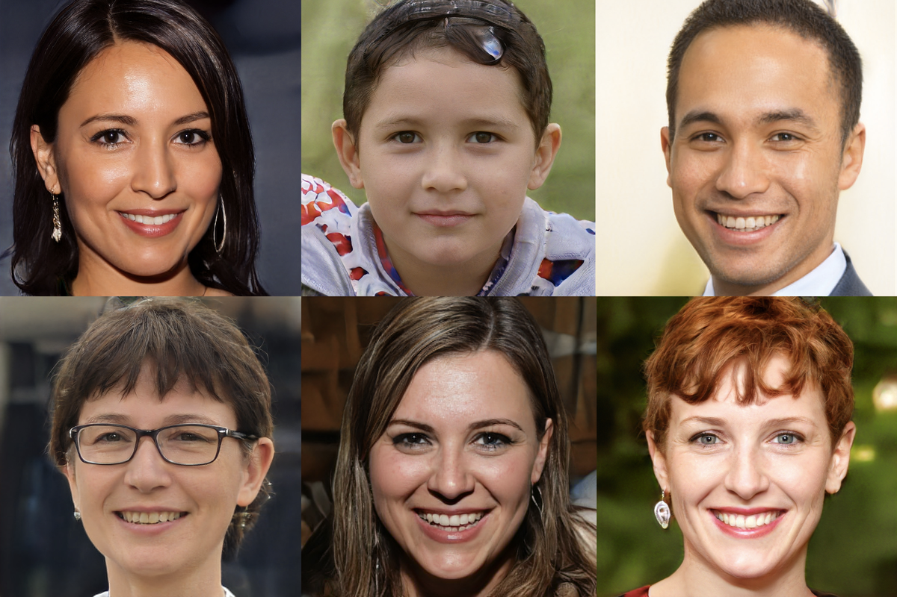

# Machine Learning Gender - by The Abandoned
***
Contributions by Julian Yanez, Connor Crossey, Kelly McVey, and Trevor Kulbeth
***

### The purpose of this project was to create a machine learning model with Keras which allowed us to either utilize the webcam for live predictions or upload a photo.
#### As of now, the project is not available as a web application, however I plan to make small revisions to this in order to transition the camera support to the web. 

## Technologies Used:
* Keras
* Tensorflow
* OpenCV Python
* MTCNN Face Recognition
* Flask
* PIL
* And More ...

## Model Design:
* Sequential Model with Image Convolution and MaxPooling
* Accepts Images of size (224, 224)
* Outputs 0 for Female and 1 for Male

## Training:
* Images came from this [UTKFace Large Scale Face Dataset](https://susanqq.github.io/UTKFace/)
* Some smaller amount of images came from the [LFW Face Database](http://vis-www.cs.umass.edu/lfw/)
* In total, training was done on around 15,000 images

## How it Works (Webcam):
* OpenCV Video Camera Feed
* Real-Time Frame Face Detection with MTCNN
* Image Cropped and Passed to Model for Prediction
* OpenCV Real-Time Drawing on Video Feed

## How it Works (Upload):
* Image Upload Saved to Directory
* Processing with OpenCV, MTCNN, and Model from file
* OpenCV Drawing on Image then Saving for Web Viewing

## Some Things Yet to Do:
* Repurpose Webcam Code in Javascript for Deployment
* Fix Browser caching issues when uploading and viewing processed file
* Further Training/Improving on Model
* Allow for Group Pictures